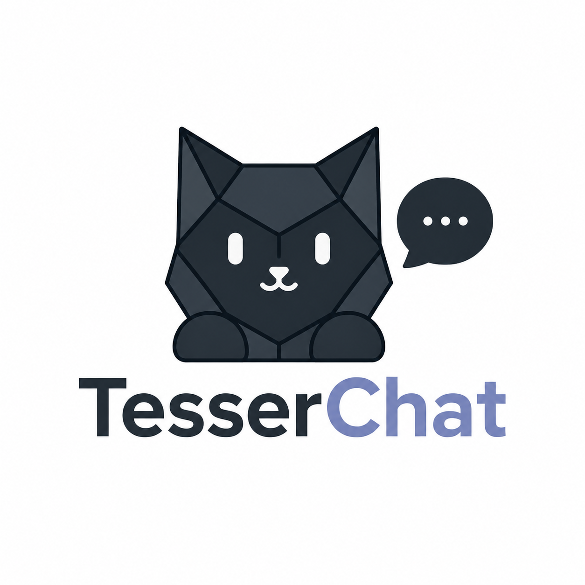

<p align="center">
  
</p>

<h1 align="center">TesserChat</h1>

<p align="center">
  Open source, self-hosted chat and communication service.
</p>

Anyone can run a server on their own hardware. There is no central service, no central account
system, and no central directory — your identity is a public/private keypair you control, portable
across every server you join.

> **Status: early development.** The server runs in Docker and manages accounts, roles, and how
> people join. It has no authentication and no chat transport yet, so it is **not usable as a chat
> platform** — there is nothing to connect a client to. The desktop client is a placeholder shell.

## Running a server

The server ships as a Docker image paired with a Postgres. You need Docker with Compose.

```bash
git clone https://github.com/TesserChat/TesserChat.git
cd TesserChat
cp .env.example .env      # then edit it — at minimum set POSTGRES_PASSWORD
docker compose up -d
docker compose logs -f tesserchat
```

The log tells you whether the server still needs setting up, and `/health` answers on
`127.0.0.1:8080` once it is serving.

**Before putting this on a public address**, read `TESSERCHAT_SETUP__OWNERPUBLICKEY` in
[.env.example](.env.example). First-run setup is unauthenticated — there is no owner yet to
authorize it — so unless you pin your own public key, whoever reaches the server first becomes its
Owner. Pinning turns that from a race into a claim only your key can make. The server warns on every
boot while no key is pinned.

Two other things worth knowing:

- The server speaks **plain HTTP** and is published to `127.0.0.1` only. Put a reverse proxy in
  front and terminate TLS there.
- The Postgres volume holds every account, role, and message. There is no central service to
  recover any of it from, so **back it up**.

## Design

[**docs/ARCHITECTURE.md**](docs/ARCHITECTURE.md) is the source of truth for how TesserChat is built
and why. It covers identity and authentication, the server model, direct messages and their
encryption, presence, and the client — including the tradeoffs that were deliberately accepted.

Sections are numbered and stable; issues, pull requests, and code comments reference them by number
(e.g. "§4.1").

## Repository layout

```
/src
  TesserChat.Server    ASP.NET Core host, SignalR hubs, REST endpoints
  TesserChat.Client    Avalonia desktop app (MVVM)
  TesserChat.Shared    Wire-protocol DTOs and crypto helpers used by both
/tests                 One test project mirroring each project above
/docs                  Architecture and design documentation
```

## Building

Requires the [.NET 10 SDK](https://dotnet.microsoft.com/download) (10.0.400 or newer — the version
is pinned in `global.json`).

```sh
dotnet build TesserChat.slnx
dotnet test TesserChat.slnx
```

Builds and tests run on Linux, Windows, and macOS in CI on every pull request.

The server's Postgres integration tests need Docker running in Linux-container mode. Without it
they skip rather than fail, so a run that reports skipped tests is expected on a machine without
Docker — not a broken checkout.

## Configuring a server

`src/TesserChat.Server/appsettings.example.json` is the tracked template listing every key the
server reads. Real `appsettings.json` files are gitignored, since they hold per-deployment secrets:

```sh
cp src/TesserChat.Server/appsettings.example.json src/TesserChat.Server/appsettings.json
```

Then set `ConnectionStrings:Postgres` to your own database. The server will not start without it.
In a container, override it as the `ConnectionStrings__Postgres` environment variable instead.

Pending migrations are applied when the server starts, so a fresh database needs no manual schema
setup. Set `Database:MigrateOnStartup` to `false` if you would rather apply them yourself. See
[§5.4](docs/ARCHITECTURE.md#54-persistence-postgresql) for both.

## Contributing

Read [docs/ARCHITECTURE.md](docs/ARCHITECTURE.md) first — particularly §0, which covers the
development workflow: tests ship alongside the feature they cover, and one feature per pull request.

## License

[MIT](LICENSE)
